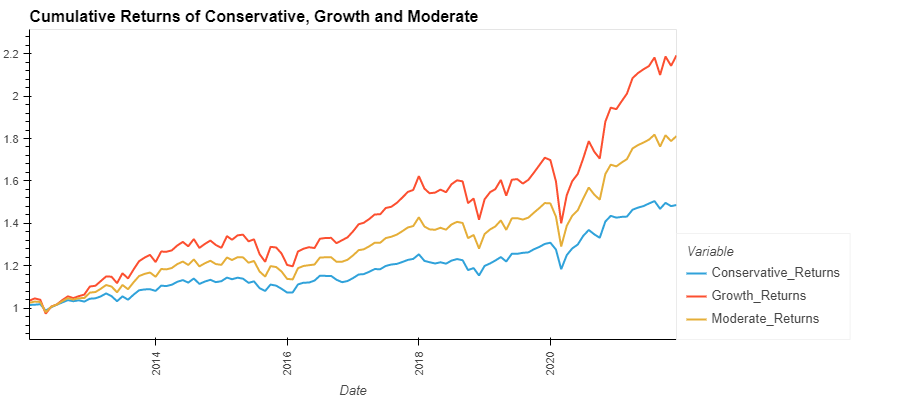
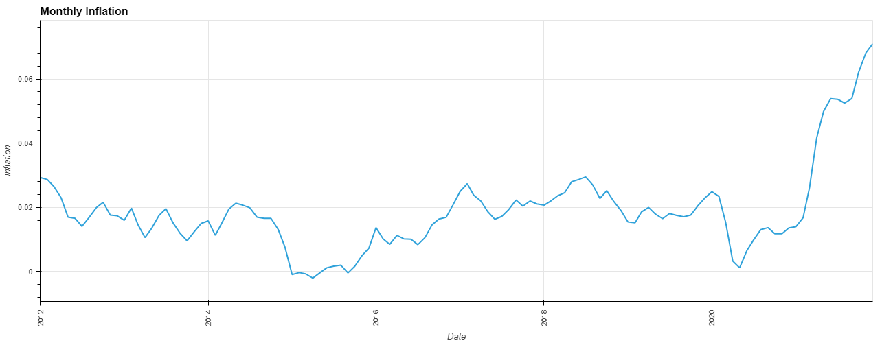

# Portfolio vs Inflation Analysis

## Description
This project will focus on Portfolio and Inflation Analysis. We will be focusing on 3 common popular portfolios with similar ETFs. ETFs are a popular investment option for various asset classes such as Equity and Bonds. They also play an important role in the portfolio of different types of investors – Growth, Moderate & Conservative. We will measure how ETFs have really performed and, given the rising rate of inflation, how you can prepare your portfolio for this shift?

---
## Table of Contents
* [Description](#description)
* [Goals](#goals)
* [Technologies](#technologies)
* [Asset Types](#asset-types-etfs)
* [Portfolios](#portfolios)
* [Performance](#performance)
* [Inflation](#inflation)
* [2021 Returns and Inflation Trends](#2021-returns-and-inflation-trends)
* [Conclusion](#conclusion)
* [Contributors](#contributors)
* [References and Resources](#references-and-resources)
* [License](#license)

---
## Goals
Our goal is to answer these 4 questions: 

* How do conservative, moderate & growth portfolios compare?
* Which asset classes will do well?
* How does inflation impact the portfolios?
* What to consider in future investment decisions? 

## Technologies
Our portfolio analysis will use the following technologies: 
* panel
* pandas
* plotly
* graph_objects
* numpy
* datetime
* pathlib
* seaborn
* hvplot
* matplotlib
* bokeh
* World Bank API 
* Google Finance 

---
  
  

## Asset Types ETFs
* VTSMX Vanguard Total Stock Market Idx Inv (US Stock Market)
* VGTSX Vanguard Total Inernational Stock Index Inv (Global Stock Market)
* VBMFX Vanguard Total Bond Market Index Inv (US Bond Market)
* PIGLX PIMCO Global Bond Opps (Global Bonds)

## Portfolios
* <b>Conservative Portfolio</b>: 48% US Bond Market, 12% Global Bonds, 14% Global Stock Market, 26% US Stock Market.  
 
* <b>Growth Portfolio</b>: 16% US Bond Market, 4% Global Bonds, 28% Global Stock Market, 52% US Stock Market.  
 
* <b>Moderate Portfolio</b>: 32% US Bond Market, 8% Global Bonds, 21% Global Stock Market, 39% US Stock Market.  
 

## Performance
  
Growth Portfolio shows the highest cumulative return percentage over the past 10 years (2012 - 2021), followed by the Moderate and Conservative Portfolios.  

---
  
Above graph outlines the the annualized standard deviation over the past 10 years (2012-2021). The Growth Portfolio has the highest volatility index.  

## Inflation
### Monthly Inflation trend over the past 10 years
  
Above graph outlines the monthly inflation over the past 10 years. As we see, there has been a drastic increase in 2021.  

---
  
Above graph outlines the correlation between the monthly portfolio returns and monthly inflation. 

## 2021 Returns and Inflation Trends
### Portfolio Returns and Monthly Inflation trend for 2021
  

## Conclusion
In conclusion, inflation does play an important role in determining the real returns of a portfolio and investors must consider the impact of inflation especially given the current trend
where US inflation has touched the highest level in 39 years. The greatest increase being between 2020 and 2021 where it went from 1.2% to 6.8% . In our analysis we reviewed the monthly inflation impact over monthly returns of each type of Portfolio i.e Growth, Moderate and Conservative. We also reviewed the co-relation of the monthly returns to monthly inflation trends. We conclude that the Growth Portfolio is best suited to protect investors under high inflation scenarios. Investors will need to decrease exposure to bond or fixed income assets.

---
### How do conservative, moderate & growth portfolios compare?
Growth Portfolio shows the highest cumulative return percentage over the past 10 years (2012 - 2021), followed by the Moderate and Conservative Portfolios. 
### Which asset classes will do well?
Based upon our past analysis, the trend shows the VTSMX asset class had the highest returns, which led to the higher returns in the Growth Portfolio (VTSMX comprising 52%). 

### How does inflation impact the portfolios?
As the inflation rate rises, the real return from the portfolio decreases. Based on our analysis of real return of each portfolio over the period of time, Growth portfolio still had higher rate of real return than conservative and moderate portfolios, however the magnitude of the return was much lower when adjusted for inflation (i.e. November 2020 Before Adj = 10.2%, After Adj = 9.03%). 

### What to consider in future investment decisions? 
It is important to consider the impact of inflation depending on your investment portfolio and variables that may impact real returns.  
Investors in Growth Portfolio will need to review their equity investments and will need to compare expected future return vs expected inflation rates. They should focus more on asset equity investments with higher return rates.  
Investors in Moderate and Conservative Portfolio should look at rebalancing their portfolio by shifting some of their fixed income assets to higher return investments to beat the impact of inflation.  
Our study is limited to ETFs and may vary with other asset classes such as real estate, crypto and gold.  
Also the inflation rate varies across countries. So it is important to review the inflation rate of the country you are investing in.  

---
 

## Contributors
Our team: 
<h2><a href="https://github.com/GuilleMGN"> GuilleMGN</a></h2>

<h2><a href="https://github.com/ksmaria"> ksmaria</a></h2>

<h2><a href="https://github.com/Prabhdyals"> Prabhdyals</a></h2>

<h2><a href="https://github.com/RiteshChugani"> RiteshChugani</a></h2>

---
## References and Resources
[InvestOPedia.com](https://www.investopedia.com/consumer-price-inflation-brisk-december-2021-5215608#:~:text=In%20December%202021%2C%20inflation%2C%20as,major%20contributors%20to%20overall%20inflation )  
[RateInflation.com](https://www.rateinflation.com/inflation-rate/usa-historical-inflation-rate/ )  
[USAToday.com](https://www.usatoday.com/story/money/2022/01/12/cpi-2021-consumer-prices-climbed-7-2021-fastest-pace-since-1982/9178235002/ )  
[PortfolioVisualizer.com](https://www.portfoliovisualizer.com/ )  

## License

Copyright © 2022